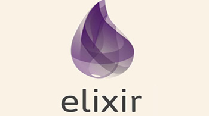
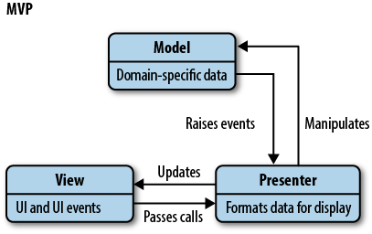

layout: true
background-image: url(images/bg.jpg)
class: center, middle

---

# Comparing Phoenix with Rails. Basics

---

# Agenda

1. Main Features
2. Similarities and Differences
3. Pros & Cons
4. Demo (maybe)

---

# Main Features

---

# Work on Elixir and Erlang VM

---

# Websockets Out of Box

---

# Presenters Out of Box

---

# Super Modular 

---

# Rapid

---

# Similarities

- Web Frameworks
- MVC
- Controllers
- Templates
- Migrations
- Support Websockets/Channels

---

# Differences

- Elixir
- CoffeeScript vs ES6
- Router Approach
- Data Management Approach
- Presenters are required

---

# Main Elixir Differences

### Image or plain code

???

In Elixir:
Elixir is a functional, immutable language(stateless modules),there are
no "objects" as you find in Ruby(so no complex class hierarchies anymore)
Methods with same name but different number of accepted
params are different methods.
Patternt matching - another cool feature (TODO: LEANMORE)
Strings: "", '' - strings in Ruby. "" - String in Elixir
'' is an array of chars(TODO: ENSURE)

(Haven't check if next phrase is true but guess yes)
Meta-programming in Elixir is a lot more powerful and
the performance cost in runtime is non-existent since
most meta-programming is done during the compile-phase.

---

# Router in Rails

### Image or plain code

---

# Router in Phoenix

### Image or plain code

???

Pipes you can see. That actually smth. like middlewares.
But if middleware works with request and response, pipe
works with connection.

Pipes are joined into pipelines, like :browser and :api.
In Rails 5 you can run `rails new --api myapi` and that
command creates scaled-down version of Rails without 
cookies, sessions, CSRF token etc etc. In Phoenix that
would be ambigious. You just can use different pipelines
for browser responses and your API.

---

# Model in Rails

---

# Model in Phoenix

???

Validations and casting of the data are defined inside
the changeset method. You provide the existing data
in addition to the data you are changing, and it will
produce an `Ecto.Changeset` struct which contains all
of the information needed to validate and save the record.
Unlike Rails where you use the class and object instances
to interact with the database, all of that in Ecto is done
through a `Repo` module. How? We'll see on the next
contoller slide.

#### Cons of Ecto

- No has_and_belongs_to_many functionality in Ecto
  may mean you need to create your own join model which
  would be unnecessary in Rails. You can then use
  `has_many :through` to create a similar structure
- No working HSTORE implementation in Ecto

#### How much is different?

- No Scope (Storing queries in an another module)
- No Lazy loading associations (Repo.preload, always if you need)

---

# Controllers

???

If I were to describe the main differences between
controllers in Rails and those in Phoenix, I would
say that they are a little simpler and a bit more
explicit in Phoenix.
There are no filters, no actions, just plugs.
There is a single conn struct which is passed from
plug to plug, containing all of the information of
the entire request, including the params. We add
or modify this struct as it flows from one plug
to another.
In typical controller method, we have to be explicit
about rendering the view that we want, passing
the variables we want it to have access to.

---

# Websockets/Channels

???

ActionCable (channels) in Rails requires either Redis or
PostreSQL to handle the pub/sub nature of channels.
You are welcome to use those with channels in Phoenix as well,
but they aren’t required due to the concurrent-by-default
nature of the language.

---

# Pros

- Native Websocket Support
- No Assets Pipeline
- Concurrency
- Speed

???

Uses brunch npm module instead of Assets Pipeline
Although don't support sass by default. But super easy to fix
with the sass-brunch module. https://github.com/brunch/sass-brunch

---

# Cons

- Under Active Development
- Integrations Support
- Popularity
- Complexity (?)

???

Current version 1.2.0. But still under active development.
You should expect to write a little more code.

---

???

So let's recap briefly what have we learned so far.

---

# Phoenix

- Rapid
- Modular
- Websocket Support
- Presenters Out of Box

---

# In Comparing with Rails it Has Similarities

???

- Web Frameworks
- MVC
- Controllers
- Templates
- Migrations
- Support Websockets/Channels

---

# In Comparing with Rails it Has Differences

???

- Elixir
- CoffeeScript vs ES6
- Router Approach
- Data Management Approach
- Presenters are required

---

# Pros & Cons

## TODO: Two blocks

???

### Pros

- Native Websocket Support
- No Assets Pipeline
- Concurrency
- Speed
- Ecto

### Cons

- Under Active Development
- Support Only a Few Integrations
- Low Popularity
- High Complexity (?)

---

# What can I read?

???

I hate when people place links directly into slides. That useless!

---

???

You can find the links I wanna share with you in presenation readme,
department chat and wiki page description.

- http://www.phoenixframework.org/
TODO: ADD MORE LINKS

---

# The End

???

If you haven't tried Phoenix yet, please do!
You won't be disappointment :)

---

# Questions?

???

Based on:

https://blog.codeship.com/comparing-rails-and-phoenix-part-i/
http://blog.codeship.com/comparing-rails-and-phoenix-part-ii/
https://medium.com/@stueccles/what-i-learned-migrating-a-rails-app-to-elixir-phoenix-f707436749aa#.wscj8utlj
https://www.quora.com/Will-Elixir-Phoenix-destroy-Ruby-on-Rails
